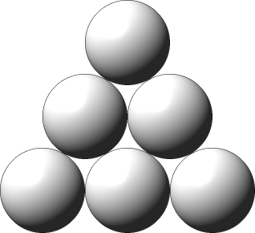
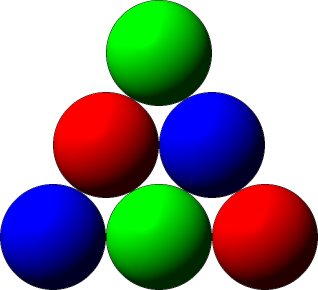

# [FoxPaintingBalls](http://community.topcoder.com/tc?module=ProblemDetail&rd=15174&pm=12146)
*Single Round Match 552 Round 1 - Division I, Level One*

## Statement
A Ball Triangle is a set of identical balls placed in a triangular shape. A Ball Triangle has *N* rows, numbered 1 to *N* from top to bottom. For all i, 1 <= i <= *N*, the i-th row contains i balls. For example, the following image shows a Ball Triangle with *N*=3.

Fox Jiro has infinitely many Ball Triangles. He can paint a Ball Triangle according to the following conditions:

Each of the balls has to be painted either red, green, or blue.
No two adjacent balls may share the same color.

The following image shows one valid coloring of a Ball Triangle for *N*=3.

Jiro wants to paint as many Ball Triangles as he can.
As long as he follows the rules above, he may color the Ball Triangles in any way he likes.
Some of the colored Ball Triangles may look exactly the same, but they don't have to.
The only other constraint is the total amount of paint available to Jiro:
In all the triangles together, he can paint at most *R* balls red, *G* balls green, and *B* balls blue.

You are given the longs *R*, *G*, and *B*.
You are also given the int *N*.
Return the maximum possible number of Ball Triangles Jiro can paint.

## Definitions
- *Class*: `FoxPaintingBalls`
- *Method*: `theMax`
- *Parameters*: `long, long, long, int`
- *Returns*: `long`
- *Method signature*: `long theMax(long R, long G, long B, int N)`

## Constraints
- *R*, *G* and *B* will each be between 0 and 1,000,000,000,000,000,000 (10^18), inclusive.
- *N* will be between 1 and 1,000,000,000, inclusive.

## Examples
### Example 1
#### Input
<c>2, 2, 2, 3</c>
#### Output
<c>1</c>
#### Reason
Jiro can paint one Ball Triangle in the same way as in the image in the statement.

### Example 2
#### Input
<c>1, 2, 3, 3</c>
#### Output
<c>0</c>
#### Reason
This time Jiro can paint no Ball Triangles.

### Example 3
#### Input
<c>8, 6, 6, 4</c>
#### Output
<c>2</c>
### Example 4
#### Input
<c>7, 6, 7, 4</c>
#### Output
<c>2</c>
### Example 5
#### Input
<c>100, 100, 100, 4</c>
#### Output
<c>30</c>
### Example 6
#### Input
<c>19330428391852493, 48815737582834113, 11451481019198930, 3456</c>
#### Output
<c>5750952686</c>
### Example 7
#### Input
<c>1, 1, 1, 1</c>
#### Output
<c>3</c>

