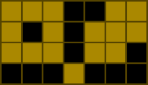
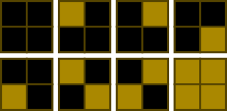

# [DengklekPaintingSquares](http://community.topcoder.com/tc?module=ProblemDetail&rd=14725&pm=11765)
*Single Round Match 532 Round 1 - Division II, Level Three*

## Statement
Mr. Dengklek lives in the Kingdom of Ducks, where humans and ducks live together in peace and harmony.

One day, the queen of the kingdom challenged Mr. Dengklek with a perplexing puzzle: she gave Mr. Dengklek an *N* × *M* board made of wood that consists of *N***M* squares. She then asked Mr. Dengklek to paint the squares according to these rules:

Each square must be either colored or empty.
Each colored square must have an even number of adjacent colored squares. Two squares are adjacent if they share a side.
For example, here is one valid solution for N=4, M=7:

In the above image, black squares denote empty squares and brown squares denote colored squares.

Of course, finding one solution to the puzzle is easy: we do not color anything. Instead, the queen asked Mr. Dengklek a much harder question: to count all valid solutions of the puzzle. Help Mr. Dengklek count the solutions and return the result modulo 1,000,000,007. Two solutions are different if there is a square that is colored in one solution and not colored in the other solution.

## Definitions
- *Class*: `DengklekPaintingSquares`
- *Method*: `numSolutions`
- *Parameters*: `int, int`
- *Returns*: `int`
- *Method signature*: `int numSolutions(int N, int M)`

## Constraints
- *N* will be between 1 and 100, inclusive.
- *M* will be between 1 and 8, inclusive.

## Examples
### Example 1
#### Input
<c>1, 1</c>
#### Output
<c>2</c>
#### Reason
Either Mr. Dengklek colors the square, or he does not. Both choices produce a valid solution.

### Example 2
#### Input
<c>2, 2</c>
#### Output
<c>8</c>
#### Reason
Here are the 8 valid solutions:

### Example 3
#### Input
<c>1, 3</c>
#### Output
<c>5</c>
### Example 4
#### Input
<c>47, 7</c>
#### Output
<c>944149920</c>

