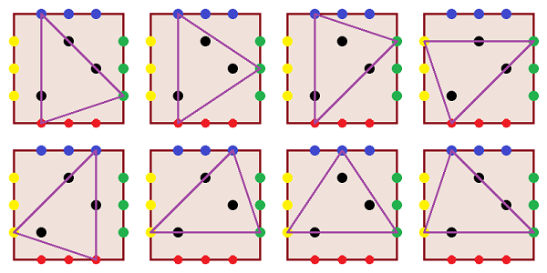

# [EnclosingTriangleColorful](http://community.topcoder.com/tc?module=ProblemDetail&rd=15697&pm=12694)
*Single Round Match 585 Round 1 - Division II, Level Three*

## Statement
You are given an int *m*. 
Consider a square in the plane such that the corners of the square have coordinates (0, 0), (*m*, 0), (*m*, *m*), and (0, *m*). 
All the lattice points on the sides of this square are colored, as described below: 
The points with coordinates (1, 0), ..., (*m*-1, 0) are red.
The points with coordinates (*m*, 1), ..., (*m*, *m*-1) are green.
The points with coordinates (*m*-1, *m*), ..., (1, *m*) are blue.
The points with coordinates (0, *m*-1), ..., (0, 1) are yellow.
Some other lattice points are black. 
Each black point lies strictly inside the square. 
You are given two int[]s: *x* and *y*. 
These describe the black points: 
For each i, there is a black point at (*x*[i], *y*[i]). 

You want to draw a triangle such that: 
its vertices have three distinct colors out of the set { red, green, blue, yellow },
all black points lie inside or on the boundary of the triangle.
Return the number of ways to draw such a triangle.

## Definitions
- *Class*: `EnclosingTriangleColorful`
- *Method*: `getNumber`
- *Parameters*: `int, int[], int[]`
- *Returns*: `int`
- *Method signature*: `int getNumber(int m, int[] x, int[] y)`

## Constraints
- *m* will be between 2 and 300, inclusive.
- *x* and *y* will each contain between 1 and 50 elements, inclusive.
- *x* and *y* will contain the same number of elements.
- Each element of *x* and *y* will be between 1 and *m*-1, inclusive.
- All points described by *x* and *y* will be distinct.

## Examples
### Example 1
#### Input
<c>4, [ 1, 2, 3 ], [ 1, 3, 2 ]</c>
#### Output
<c>8</c>
#### Reason
The picture shows the 8 ways to draw a triangle. 

### Example 2
#### Input
<c>7, [ 1, 1, 6, 6 ], [ 1, 6, 1, 6 ]</c>
#### Output
<c>0</c>
### Example 3
#### Input
<c>4, [ 2 ], [ 2 ]</c>
#### Output
<c>72</c>
### Example 4
#### Input
<c>10, [ 2, 6, 7, 6 ], [ 7, 7, 9, 3 ]</c>
#### Output
<c>52</c>
### Example 5
#### Input
<c>15, [ 7, 6, 5, 4, 3 ], [ 1, 4, 7, 10, 13 ]</c>
#### Output
<c>150</c>
### Example 6
#### Input
<c>300, [ 117, 183, 181, 118, 132, 128, 184, 150, 168, 121,    179, 132, 168, 182, 119, 117, 180, 120, 175, 177,    116, 175, 128, 163, 181, 178, 123, 118, 172, 143,    163, 157, 179, 122, 121, 119, 157, 122, 150, 180,    137, 177, 125, 123, 172, 125, 137, 143, 120, 178 ], [ 157, 157, 132, 163, 181, 180, 150, 116, 181, 125,    125, 119, 119, 163, 132, 143, 172, 172, 179, 178,    150, 121, 120, 118, 168, 123, 178, 137, 120, 117,    182, 117, 175, 177, 175, 168, 183, 123, 184, 128,    118, 122, 179, 122, 180, 121, 182, 183, 128, 177 ]</c>
#### Output
<c>21690886</c>

