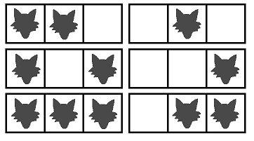

# [WolfInZooDivTwo](http://community.topcoder.com/tc?module=ProblemDetail&rd=15498&pm=12533)
*Single Round Match 578 Round 1 - Division II, Level Three*

## Statement
Mr. Pasuterukun is walking along a straight road.
He is cautious, because he has heard that there may be some wolves on the road.

The road consists of *N* sections.
The sections are numbered 0 through *N*-1, in order.
Each section of the road contains at most one wolf.

You have M additional pieces of information about the positions of the wolves.
Each piece of information is an interval of the road that contains at least one wolf.
More precisely, for each i between 0 and M-1, inclusive, you are given two integers left[i] and right[i] such that the sections with numbers in the range from left[i] to right[i], inclusive, contain at least one wolf in total.

You are given two String[]s *L* and *R*.
The concatenation of all elements of *L* will be a single space separated list containing the integers left[0] through left[M-1].
*R* contains all the integers right[i] in the same format.

Return the number of ways in which wolves can be distributed in the sections of the road, modulo 1,000,000,007.

## Definitions
- *Class*: `WolfInZooDivTwo`
- *Method*: `count`
- *Parameters*: `int, String[], String[]`
- *Returns*: `int`
- *Method signature*: `int count(int N, String[] L, String[] R)`

## Constraints
- *N* will be between 1 and 300, inclusive.
- *L* and *R* will contain between 1 and 50 elements, inclusive.
- Each element of *L* and *R* will contain between 1 and 50 characters, inclusive.
- Each character in *L* and *R* will be a digit ('0'-'9') or a space (' ').
- M will be between 1 and 300, inclusive.
- The concatenation of all elements of *L* will be a single space separated list of M integers. The integers will be between 0 and N-1, inclusive, and they will be given without unnecessary leading zeroes.
- The concatenation of all elements of *R* will be a single space separated list of M integers. The integers will be between 0 and N-1, inclusive, and they will be given without unnecessary leading zeroes.
- For each i, the i-th integer in *L* will be smaller than or equal to the i-th integer in *R*.

## Examples
### Example 1
#### Input
<c>5, ["0 1"], ["2 4"]</c>
#### Output
<c>27</c>
#### Reason
There is at least one wolf on the sections 0 through 2, and at least one wolf on the sections 1 through 4.

### Example 2
#### Input
<c>10, ["0 4 2 7"], ["3 9 5 9"]</c>
#### Output
<c>798</c>
### Example 3
#### Input
<c>100, ["0 2 2 7 10 1","3 16 22 30 33 38"," 42 44 49 51 57 60 62"," 65 69 72 74 77 7","8 81 84 88 91 93 96"], ["41 5 13 22 12 13 ","33 41 80 47 40 ","4","8 96 57 66 ","80 60 71 79"," 70 77 ","99"," 83 85 93 88 89 97 97 98"]</c>
#### Output
<c>250671525</c>
#### Reason
You must first concatenate the elements of *L* and only then split it into integers. The same holds for *R*.

### Example 4
#### Input
<c>3, ["1"], ["2"]</c>
#### Output
<c>6</c>
#### Reason
The following picture shows all possible patterns.

