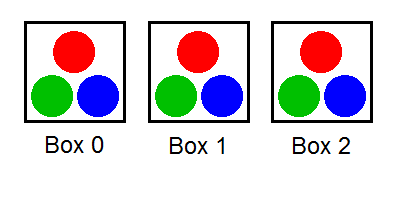
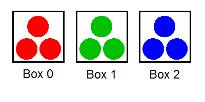

# [BallsSeparating](http://community.topcoder.com/tc?module=ProblemDetail&rd=15488&pm=12398)
*Single Round Match 568 Round 1 - Division I, Level One*

## Statement
There are *N* boxes numbered from 0 to *N*-1, inclusive. For each i, box i contains *red*[i] red balls, *green*[i] green balls, and *blue*[i] blue balls.

Fox Ciel wants to separate the balls by colors. In each operation, she can pick a single ball from some box and put it into another box. She considers the balls to be separated if no box contains balls of more than one color.

Return the minimal number of operations required to separate the balls. If this is impossible, return -1.

## Definitions
- *Class*: `BallsSeparating`
- *Method*: `minOperations`
- *Parameters*: `int[], int[], int[]`
- *Returns*: `int`
- *Method signature*: `int minOperations(int[] red, int[] green, int[] blue)`

## Constraints
- *red*, *green* and *blue* will each contain between 1 and 50 elements, inclusive.
- *red*, *green* and *blue* will contain the same number of elements.
- Each element of *red*, *green* and *blue* will be between 1 and 1,000,000, inclusive.

## Examples
### Example 1
#### Input
<c>[1, 1, 1], [1, 1, 1], [1, 1, 1]</c>
#### Output
<c>6</c>
#### Reason
One way to separate the balls in six operations is as follows:
Move a red ball from box 1 to box 0.
Move a red ball from box 2 to box 0.
Move a green ball from box 0 to box 1.
Move a green ball from box 2 to box 1.
Move a blue ball from box 0 to box 2.
Move a blue ball from box 1 to box 2.
The pictures on the left and on the right show the initial and the final states of the balls, respectively.

 

### Example 2
#### Input
<c>[5], [6], [8]</c>
#### Output
<c>-1</c>
#### Reason
It is impossible to separate the balls.

### Example 3
#### Input
<c>[4, 6, 5, 7], [7, 4, 6, 3], [6, 5, 3, 8]</c>
#### Output
<c>37</c>
### Example 4
#### Input
<c>[7, 12, 9, 9, 7], [7, 10, 8, 8, 9], [8, 9, 5, 6, 13]</c>
#### Output
<c>77</c>
### Example 5
#### Input
<c>[842398, 491273, 958925, 849859, 771363, 67803, 184892, 391907, 256150, 75799], [268944, 342402, 894352, 228640, 903885, 908656, 414271, 292588, 852057, 889141], [662939, 340220, 600081, 390298, 376707, 372199, 435097, 40266, 145590, 505103]</c>
#### Output
<c>7230607</c>

