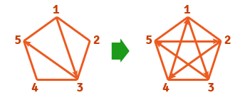

# [PolygonTraversal2](http://community.topcoder.com/tc?module=ProblemDetail&rd=15494&pm=12478)
*Single Round Match 574 Round 1 - Division II, Level Three*

## Statement
Manao had a sheet of paper. He drew *N* points on it, which corresponded to vertices of a regular *N*-gon. He numbered the vertices from 1 to *N* in clockwise order.

After that, Manao connected several pairs of points with straight line segments. Let M be the number of elements in *points*. Manao connected points *points*[i] and *points*[i+1] for each i between 0 and M-2. Note that all numbers in *points* are distinct.

Manao took a look at what he had drawn and decided to continue his traversal by adding every remaining point of the polygon to it and then returning to point *points*[0]. In other words, Manao is going to connect point *points*[M-1] with some point tail[0] which is not in *points*, then connect tail[0] with some point tail[1] which is neither in *points* nor in tail, and so on. In the end, he will connect point tail[*N*-M-1] with point *points*[0], thus completing the traversal.

Manao is really fond of intersections, so he wants to continue the traversal in such a way that every new line segment he draws intersects with at least one of the previously drawn line segments. (Note that the set of previously drawn segments includes not only the original set of segments, but also the new segments drawn before the current one.) Count and return the number of ways for him to complete the traversal.

## Definitions
- *Class*: `PolygonTraversal2`
- *Method*: `count`
- *Parameters*: `int, int[]`
- *Returns*: `int`
- *Method signature*: `int count(int N, int[] points)`

## Constraints
- *N* will be between 4 and 13, inclusive.
- *points* will contain between 2 and *N*-1 elements, inclusive.
- Each element of *points* will be between 1 and *N*, inclusive.
- All elements of *points* will be distinct.

## Examples
### Example 1
#### Input
<c>5, [1, 3, 5]</c>
#### Output
<c>1</c>
#### Reason
The only way for Manao to complete the traversal is:

### Example 2
#### Input
<c>6, [1, 4, 2]</c>
#### Output
<c>1</c>
#### Reason
The only way to complete the traversal is to visit vertices {6, 3, 5, 1}, in order.
Note that the segment 5-1 does not intersect the original two segments (1-4 and 4-2), but it does intersect segments 2-6 and 6-3 which were both added before 5-1.

### Example 3
#### Input
<c>7, [2, 4, 7]</c>
#### Output
<c>2</c>
#### Reason
The two possible tails are:
3-5-1-6-2
3-6-1-5-2

### Example 4
#### Input
<c>7, [1, 2, 3, 4, 6, 5]</c>
#### Output
<c>0</c>
#### Reason
Manao needs to connect points 5 and 7 and then connect points 7 and 1. Obviously, segment 1-7 will not intersect with any other segment.

### Example 5
#### Input
<c>11, [1, 5, 10]</c>
#### Output
<c>1412</c>

