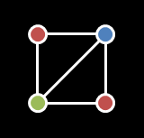
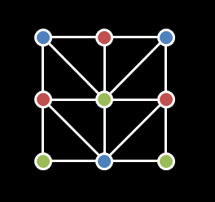

# [ThreeColorabilityEasy](http://community.topcoder.com/tc?module=ProblemDetail&rd=15699&pm=12699)
*Single Round Match 587 Round 1 - Division II, Level Three*

## Statement
There is a H times W rectangle divided into unit cells.
The rows of cells are numbered 0 to H-1 from top to bottom, and the columns are numbered 0 to W-1 from left to right.
The corners of cells are called lattice points.
By definition, there are (H+1)*(W+1) lattice points in our rectangle.

Each of the four edges of each cell is painted white.
Additionally, in each cell exactly one of the two diagonals is painted white.
Two lattice points are called adjacent if they are connected by a white line segment.
(In other words, consecutive corners of a cell are always adjacent, opposite corners of a cell are adjacent if and only if they are connected by a painted diagonal, and no other pairs of lattice points are adjacent.)

We now want to color each of the lattice points using one of three available colors: red, green, or blue.
There is only one constraint: adjacent lattice points are not allowed to share the same color.

You are given a String[] *cells* with H elements, each consisting of W characters.
If *cells*[i][j] is 'N', there is a diagonal line from the top left to the bottom right corner in the cell in row i, column j.
If *cells*[i][j] is 'Z', there is a diagonal line from the top right to the bottom left corner in the cell in row i, column j.

If there is at least one valid way to color all lattice points, return "Yes" (quotes for clarity).
Otherwise, return "No".

## Definitions
- *Class*: `ThreeColorabilityEasy`
- *Method*: `isColorable`
- *Parameters*: `String[]`
- *Returns*: `String`
- *Method signature*: `String isColorable(String[] cells)`

## Constraints
- *cells* will contain between 1 and 50 elements, inclusive.
- Each element of *cells* will contain between 1 and 50 characters, inclusive.
- All elements of *cells* will contain the same number of characters.
- Each character of *cells* will be either 'N' or 'Z'.

## Examples
### Example 1
#### Input
<c>["Z"]</c>
#### Output
<c>"Yes"</c>
#### Reason
One of the possible colorings is as follows.

### Example 2
#### Input
<c>["NZ" ,"NZ"]</c>
#### Output
<c>"Yes"</c>
#### Reason

### Example 3
#### Input
<c>["ZZZ" ,"ZNZ"]</c>
#### Output
<c>"No"</c>
### Example 4
#### Input
<c>["NZNZNNN" ,"NNZNNNZ" ,"NNNNZZZ" ,"ZZZNZZN" ,"ZZNZNNN" ,"NZZZZNN" ,"ZZZNZNN"]</c>
#### Output
<c>"No"</c>
### Example 5
#### Input
<c>["ZZZZ" ,"ZZZZ" ,"ZZZZ"]</c>
#### Output
<c>"Yes"</c>

